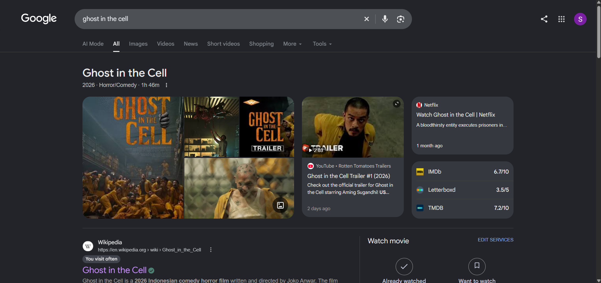
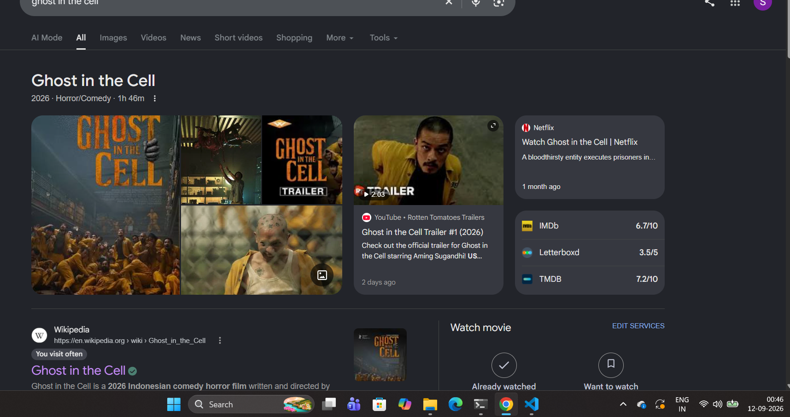

# Gravity Browser Flow 🌪️🌀

## Basic Details

### Team Name

**Jaseel Tinker Team**

### Team Members

* **Team Lead:** Muhammed Jaseel V — MESCET, Kunnukara

---

## Project Description

**Gravity Browser Flow** is a useless Chrome extension that makes webpages behave as if gravity suddenly stopped working. 😂

While browsing normally, the page looks completely normal. But when you stop scrolling, text, images, headings, and other webpage elements start **floating and gently oscillating in random horizontal and vertical directions**.

It doesn't improve productivity.

It doesn't solve any real problem.

It just makes browsing weird. 🌪️

---

## The Problem (that doesn't exist)

Have you ever been reading a webpage and thought:

> "This page is way too stable."

Probably not.

Unfortunately, webpages are designed to stay in one place. Text stays where it is. Images stay where they are. Everything behaves normally.

**This is clearly a problem.**

People deserve webpages that randomly float around when they stop scrolling.

---

## The Solution (that nobody asked for)

We created **Gravity Browser Flow**.

The extension detects important elements on a webpage and applies smooth floating animations to them.

When the user stops scrolling:

* 📝 Text starts floating
* 🖼️ Images gently move around
* 📦 Sections drift in different directions
* ↕️ Elements move both horizontally and vertically
* 🔄 Each element has its own movement pattern
* 🌀 Small rotations make the movement feel more natural

Basically, we removed gravity from the browser.

**You're welcome.**

---

# Technical Details

## Technologies/Components Used

### For Software

* **JavaScript** — Animation and webpage manipulation
* **HTML** — Extension interface
* **CSS** — Extension styling
* **Chrome Extensions API**
* **Chrome Storage API**
* **MutationObserver API**
* **requestAnimationFrame**
* **Visual Studio Code** — Development
* **Git & GitHub** — Version control

### For Hardware

No hardware components are required.

Just a computer, a Chrome browser, and questionable life choices. 😂

---

# Implementation

## For Software

### Installation

1. Clone this repository:

```bash
git clone https://github.com/shefinmuhammed505-cyber/useless.git
```

2. Open **Google Chrome**.

3. Go to:

```text
chrome://extensions
```

4. Enable **Developer mode**.

5. Click **Load unpacked**.

6. Select the cloned project folder.

7. Enable **Gravity Browser Flow**.

---

## Run

Once the extension is loaded:

1. Open any webpage.
2. Start scrolling normally.
3. Stop scrolling.
4. Watch the webpage slowly lose its sense of gravity. 🌪️

Scroll again and the effect pauses.

Stop scrolling again and the floating begins again.

---

# Project Documentation

## How It Works

The extension scans the webpage and finds elements such as:

* Headings
* Paragraphs
* Lists
* Images
* Videos
* Tables
* Articles
* Sections
* Links
* Figures

Each usable element receives its own random animation properties.

The animation uses mathematical **sine and cosine waves** to create smooth movement.

Different elements receive different:

* Movement phases
* Amplitudes
* Frequencies
* Horizontal strengths
* Vertical strengths
* Rotation values

This prevents every element from moving together and creates a more natural **zero-gravity effect**.

---

# Screenshots

### Screenshot 1 — Normal Webpage



*The webpage in its normal state before Gravity Browser Flow is activated.*

### Screenshot 2 — Gravity Activated



*The webpage after Gravity Browser Flow is activated, with elements floating in different directions.*


*The webpage experiencing the zero-gravity effect after scrolling stops.*

---

# Workflow

```text
             User opens webpage
                     │
                     ▼
          Chrome Extension loads
                     │
                     ▼
          Detect webpage elements
                     │
                     ▼
            User starts scrolling
                     │
                     ▼
            Scrolling detected
                     │
                     ▼
           User stops scrolling
                     │
                     ▼
          Gravity effect activates
                     │
                     ▼
       Random X + Y floating movement
                     │
                     ▼
          Elements gently oscillate
                     │
                     ▼
            User scrolls again
                     │
                     ▼
       Animation temporarily pauses
```

---

# Project Demo

## Video

[Watch the Gravity Browser Flow Demo](https://drive.google.com/file/d/1HYKn_MTOvm5eLQh7-fZonCu5cgJNznQV/view?usp=sharing)

*The demo shows a normal webpage being transformed into a completely unnecessary zero-gravity browsing experience.*

---

# Additional Demos

* Chrome Extension Demo
* Before/After webpage comparison
* Floating animation demonstration

---

# Team Contributions

* **Muhammed Jaseel V:** Project concept, JavaScript animation system, Chrome extension development, testing, and GitHub setup.
* **Muhammed Shefin:** UI/UX ideas, animation behavior, project development, testing, and documentation.

---

# Why?

Because we could.

And because apparently webpages weren't useless enough already. 😂

---

Made with ❤️ and absolutely no practical purpose at **TinkerHub Useless Projects**

---
Made with ❤️ at TinkerHub Useless Projects 


